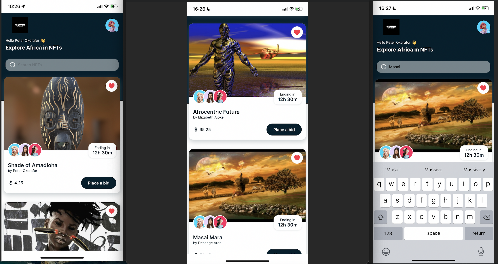

# Functional NFT Marketplace UI

> This is an implementation of the functional UI of an open source NFT Marketplace focused on African Art and collectables.

## Built With

- JavaScript
- Expo CLI
- ReactNative

## Getting Started

To get a local copy up and running follow these simple example steps.

### Prerequisites
- Have Expo Go installed on mobile device
- Setup npm and Expo CLI
- Download this repository as .zip and unpack.

### Setup
- Navigate to the local copy of repo and run npm install
- If npm install shows error,try:
    `npm cache clean --force`
- Also check if all dependencies are installed and up to date. You can run this for missing dependencies:
    `npm install --legacy-peer-deps`
- Run
    `expo start`
- Scan the QR code to load the app on your mobile device within the Expo Go app.

## Authors

👤 **Author**

- GitHub: [@peterdtitan](https://github.com/peterdtitan)
- Twitter: [@PeterDeTitan](https://twitter.com/PeterDeTitan)
- LinkedIn: [Peter Okorafor](https://linkedin.com/in/peterokorafor)

## 🤝 Contributing

Contributions, issues, and feature requests are welcome!

Feel free to check the [issues page](../../issues/).

## Show your support

Give a ⭐️ if you like this project!

## Acknowledgments

- Alvxyz for the Dribble UI template
  [ProNef Template](https://dribbble.com/alvxyz)
  
## 📝 License

This project is [MIT](./MIT.md) licensed.